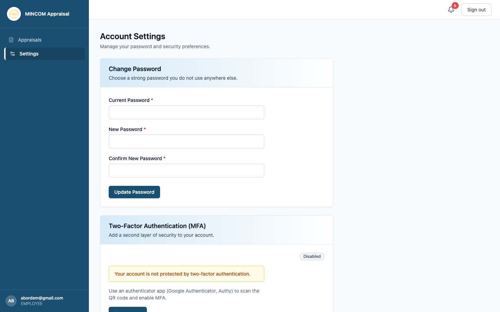

# Account Settings and Password

> **Role:** Everyone

## Overview

Use the **Settings** page to change your password and enable Two-Factor Authentication (MFA). Two-Factor Authentication adds a second layer of security by requiring a 6-digit code from an authenticator app whenever you sign in.

## Steps

### Step 1: Open Settings

Click **Settings** in the left sidebar.

### Step 2: Change your password

1. Type your current password into **Current Password**.
2. Type a new password into **New Password**.
3. Repeat the new password in **Confirm New Password**.
4. Click **Update Password**.

> 💡 **Tip:** Choose a strong password you do not use anywhere else. A passphrase of three random words is easier to remember and harder to guess than a short complex password.

### Step 3: Enable Two-Factor Authentication

1. Under **Two-Factor Authentication (MFA)**, look for the status label. **Disabled** means MFA is currently off.
2. Click **Set Up MFA**.
3. Open an authenticator app on your phone (Google Authenticator, Authy, Microsoft Authenticator, or 1Password).
4. Scan the QR code shown on screen.
5. Enter the 6-digit code from the app to confirm enrolment.
6. Save the recovery codes shown on screen somewhere safe — you will need them if you lose your phone.

## What Happens Next

- Once MFA is enabled, you must enter a code from your authenticator app every time you sign in.
- Your password change takes effect immediately. You stay signed in on this device, but other sessions are signed out.

## Common Questions

**Q: I lost my phone — how do I get back in?**
A: Use one of the recovery codes you saved when you enrolled. Each code works once. If you have used them all, ask HR to reset MFA on your account.

**Q: Is MFA required?**
A: It depends on your organisation's policy. Where MFA is enforced, you cannot sign in without it.

## Troubleshooting

| Problem | Cause | Solution |
|---------|-------|----------|
| "Current password is incorrect" | Typo or caps lock | Re-enter carefully |
| Authenticator code rejected | Phone clock is out of sync | Enable automatic time on your phone |
| QR code does not scan | Camera lighting | Type the 32-character secret manually instead |
