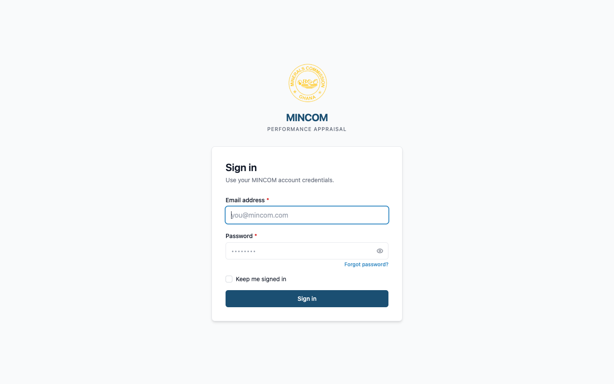

# Logging In

> **Role:** Everyone

## Overview

You access the MINCOM Appraisal Platform through any modern web browser. You sign in once with your work email address and password.

> 💡 **First time signing in?** If you have just received an invitation email with a temporary password, see [First-Time Sign-In](first-time-sign-in.md) instead.

## Steps

### Step 1: Open the platform in your browser

Go to the platform URL provided to you by HR. The sign-in page loads.

### Step 2: Enter your email and password

1. Type your work email address into the **Email address** field.
2. Type your password into the **Password** field. Use the **Show password** button on the right of the field if you want to check what you have typed.
3. Tick **Keep me signed in** if you are on a personal device and want to stay signed in for longer.
4. Click **Sign in**.

### Step 3: Land on your default page

After a successful sign-in you are taken to the **Appraisals** page. The left sidebar shows your name, email, and role label (for example **Appraisee**, **Appraisor**, or **HR Admin**).

## What Happens Next

- The browser remembers you for the duration of your session.
- All actions you take are recorded in the secure audit log.
- If your account has Two-Factor Authentication (MFA) enabled, you are prompted for a 6-digit code from your authenticator app.

## Common Questions

**Q: I forgot my password. What do I do?**
A: Click the **Forgot password?** link on the sign-in page. You will receive an email with a link to set a new password.

**Q: I don't have an account yet.**
A: HR creates accounts for new staff. Contact your HR administrator if you have not received an invitation email.

## Troubleshooting

| Problem | Cause | Solution |
|---------|-------|----------|
| "Invalid credentials" message | Wrong email or password | Re-enter carefully, then use **Forgot password?** if needed |
| Account locked | Too many failed attempts | Wait 30 minutes or ask HR to unlock |
| Page does not load | Network issue | Check your internet connection or VPN |
