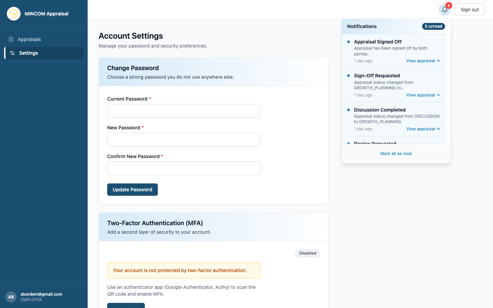

# Navigating the Platform

> **Role:** Everyone

## Overview

Every page on the platform shares the same layout: a left sidebar with the main menu, a top bar with notifications and sign-out, and the main content area in the middle.

## The left sidebar

The sidebar lists the pages you can visit. The menu items you see depend on your role.

- **Appraisees** see: Appraisals, Settings.
- **Appraisors** see: Appraisals, Employees, Settings.
- **HR Admins** see: Appraisals, Employees, Cycles, Reports, Users, Audit Log, Settings.

Your name, email and role are shown at the bottom of the sidebar.

## The top bar

The top bar contains:

- **Breadcrumb** (when inside an appraisal) — shows where you are.
- **Notifications bell** — opens a panel listing recent notifications. A red badge appears when you have unread notifications.
- **Sign out** — ends your session.

## The main content area

This is where pages, tables, and forms appear. Most pages include filters or a search field at the top, a results table in the middle, and pagination controls at the bottom.

## Tabs inside an appraisal

When you open an appraisal you see five tabs across the top of the form:

1. **Key Deliverables** — performance objectives grouped by Balanced Scorecard perspective.
2. **Competencies** — behavioural ratings.
3. **Comments** — written notes from you and your manager.
4. **Growth Plan** — strengths, weaknesses, training needs, career goals.
5. **Sign-off** — final acceptance.

## Common Questions

**Q: Why don't I see "Cycles" or "Reports" in my sidebar?**
A: Those pages are only visible to HR Admins. If you should have access, ask HR to update your role.

**Q: How do I get back to the appraisals list?**
A: Click **Appraisals** in the sidebar, or use the breadcrumb at the top of an appraisal.
