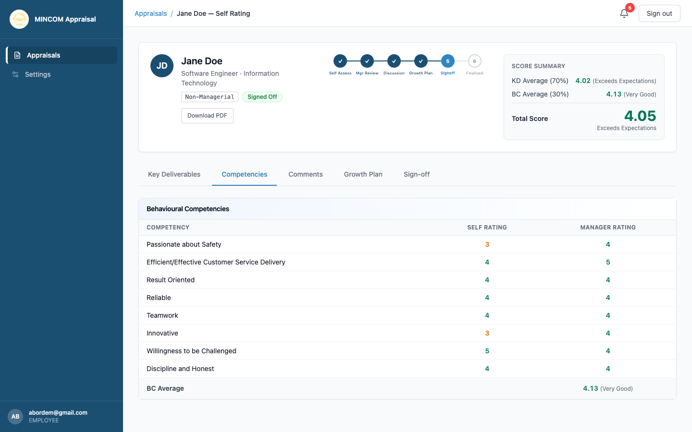
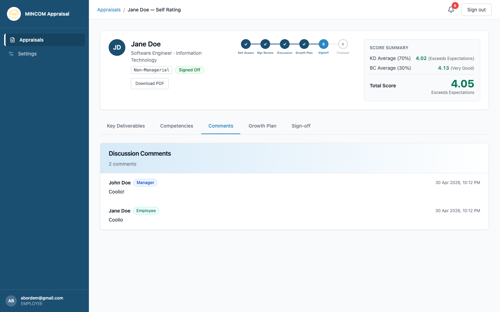

# Reviewing Your Manager's Ratings

> **Role:** Employee

## Overview

After your manager finishes their review, the appraisal moves to the **Discussion** stage. You can now see the manager's ratings side by side with your own self-ratings, and add comments before signing off.

## Steps

### Step 1: Open the appraisal

From the **Appraisals** page, find the row in **Discussion** status and click **View**.

### Step 2: Compare ratings on Key Deliverables

The **Key Deliverables** tab shows four columns side by side:

- Description
- Weight (%)
- **Self Rating** — what you submitted
- **Mgr Rating** — what your manager submitted
- **Weighted Score** — calculated from your manager's rating multiplied by the weight

The score summary at the top of the page calculates:

- **KD Average** out of 5 (carries 70% of the total).
- **BC Average** out of 5 (carries 30% of the total).
- **Total Score** out of 5, with the matching Performance Descriptor.

### Step 3: Compare ratings on Competencies

Open the **Competencies** tab. Each row shows your self-rating and your manager's rating. Where the two differ significantly, this is a useful signal for discussion.

### Step 4: Add your discussion comments

Open the **Comments** tab and type your response. This is your chance to:

- Acknowledge agreement.
- Note where you see things differently.
- Add context that did not come up in your self-assessment.

> 💡 **Tip:** A short, factual comment from each party is required before the appraisal can move to **Growth Planning**.

## What Happens Next

- Once both you and your manager have added at least one comment, your manager moves the appraisal to **Growth Planning**.
- Your manager then drafts the growth plan — you can view it in the **Growth Plan** tab.

## Common Questions

**Q: My manager and I disagree on a rating. What should I do?**
A: Use the Comments tab to record your perspective. Schedule a face-to-face conversation. If you still cannot agree, you can dispute the appraisal at the sign-off stage and HR will intervene.

**Q: Can I edit my self-ratings now?**
A: No. Self-ratings are locked once you submit. The Comments thread is the right place to add context.
