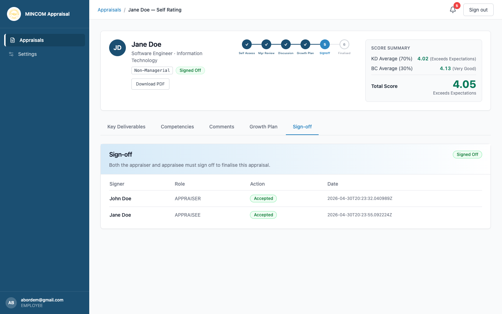

# Signing Off Your Appraisal

> **Role:** Employee

## Overview

Sign-off is the final step before HR closes your appraisal. You either **Accept** the appraisal — recording your formal agreement — or **Reject** it, which moves it back to **Discussion** as a dispute for HR to mediate.

## Steps

### Step 1: Open the appraisal

From the **Appraisals** page, find the row in **Pending Signoff** status and click **View**.

### Step 2: Review the full appraisal one more time

Use the tabs to revisit each section:

- Key Deliverables and the weighted scores.
- Competencies and the side-by-side ratings.
- Comments — make sure your perspective is recorded.
- Growth Plan — your manager's development recommendations.

### Step 3: Open the Sign-off tab

Click **Sign-off**. You see two options for the employee signature: **Accept** and **Reject**.

### Step 4a: Accept the appraisal

If you agree:

1. Click **Accept**.
2. Confirm in the dialog.

Your acceptance is recorded with a timestamp.

### Step 4b: Reject and dispute

If you do not agree:

1. Click **Reject**.
2. Type a short reason for the dispute.
3. Confirm.

The appraisal returns to **Discussion** so you and your manager can resolve the disagreement, with HR available to mediate.

> ⚠️ **Warning:** Once you click **Accept**, you cannot reverse the decision. Read everything carefully before confirming.

## What Happens Next

- **If you accept and your manager has also accepted:** the appraisal moves to **Signed Off**. HR will then finalise it.
- **If you accept but your manager has not yet acted:** the appraisal stays in **Pending Signoff** waiting for the manager.
- **If you reject:** the appraisal moves to **Disputed** status and back to the discussion. HR is notified.

## Common Questions

**Q: Can I sign off before my manager?**
A: Yes. Either party can act first. The appraisal moves to **Signed Off** only when both parties have accepted.

**Q: I clicked Accept by mistake — how do I undo it?**
A: You cannot undo it yourself. Contact HR immediately and they can reverse it through the audit log if the appraisal has not yet been finalised.

**Q: What does "Disputed" mean?**
A: It means at least one party rejected the appraisal at sign-off. The appraisal returns to discussion for resolution.
