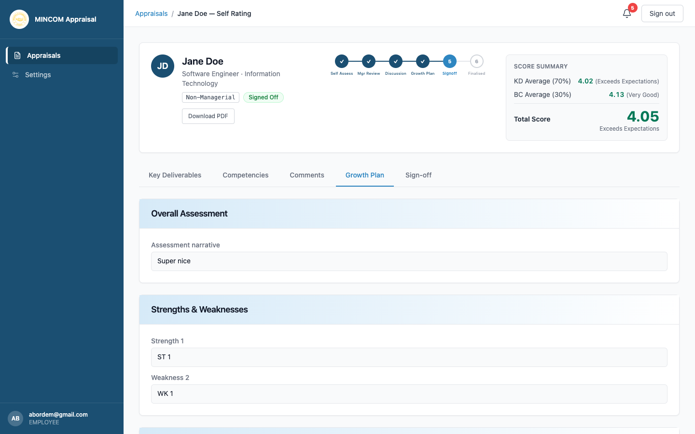

# Viewing Your Growth Plan

> **Role:** Employee

## Overview

The growth plan summarises your manager's view of your strengths and weaknesses, the training you should pursue in the next cycle, and your career development direction. You see the plan as soon as your manager has written it.

## Steps

### Step 1: Open the appraisal

From the **Appraisals** page, click **View** on the row in **Growth Planning** or any later status.

### Step 2: Open the Growth Plan tab

Click **Growth Plan** in the tabs across the top of the appraisal.

### Step 3: Read each section

The growth plan is organised into five sections:

- **Overall Assessment** — your manager's narrative summary of the cycle.
- **Strengths and Weaknesses** — what is working well and what to develop.
- **Training Needs** — courses, certifications, or on-the-job experiences your manager recommends.
- **Career Plans** — direction for your next role or progression.
- **Career Plan Development Needs** — what you need to acquire to reach the career goals listed above.

If a section says **No entries recorded**, your manager has not added anything to that section.

## What Happens Next

- Once the growth plan is complete, your manager submits the appraisal to **Pending Signoff**.
- You receive a notification and can then accept (sign off) or dispute the appraisal — see [Signing off your appraisal](signing-off.md).

## Common Questions

**Q: Can I edit the growth plan?**
A: No. Only your manager can write or change the growth plan. If you want to add to it, ask your manager during your discussion.

**Q: How is the plan used?**
A: HR uses the aggregated training needs from all growth plans to plan organisation-wide training programmes. Your direct manager uses your plan to track your progress in the next cycle.
