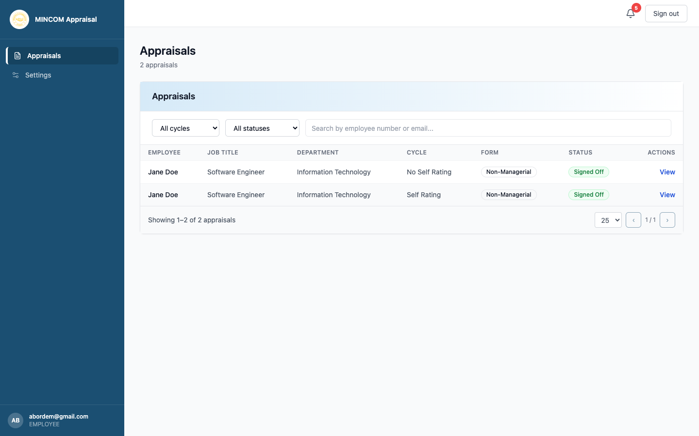

# Viewing Your Appraisals

> **Role:** Employee

## Overview

The **Appraisals** page shows every appraisal you are part of — current and historical. Each row is one appraisal in one cycle.

## Steps

### Step 1: Open the Appraisals page

Click **Appraisals** in the left sidebar. The platform opens to this page after you sign in, so you usually start here already.

### Step 2: Read the table

Each row contains:

- **Appraisee** — your name (or the report's name if you are an Appraisor).
- **Job Title** and **Department** — taken from your employee record.
- **Cycle** — which appraisal cycle the row belongs to (for example "2025 Mid-Year").
- **Form** — either **Managerial** (Form A) or **Non-Managerial** (Form B).
- **Status** — where the appraisal is in the workflow (see [Workflow stages](../05-reference/workflow-stages.md)).
- **Actions** — a **View** button to open the appraisal.

### Step 3: Filter and search

If you have appraisals in multiple cycles, use the controls above the table:

- **Filter by cycle** — narrow to one cycle.
- **Filter by status** — show only appraisals in a specific stage (for example **Self Assessment** or **Pending Signoff**).
- **Search appraisals** — type a word from the cycle name.

### Step 4: Open an appraisal

Click **View** on any row to open the appraisal form.

## What Happens Next

- Opening an appraisal lands you on the **Key Deliverables** tab by default.
- The five tabs (Key Deliverables, Competencies, Comments, Growth Plan, Sign-off) let you move between sections.
- A workflow progress bar at the top shows you which stage the appraisal is in.

## Common Questions

**Q: Why don't I see an appraisal for this cycle?**
A: HR may not yet have activated the cycle, or you may have been excluded. Check with HR.

**Q: Some old appraisals are missing.**
A: Only appraisals that have been migrated into the platform appear. Paper-based appraisals from before your organisation adopted the system may not be present.
