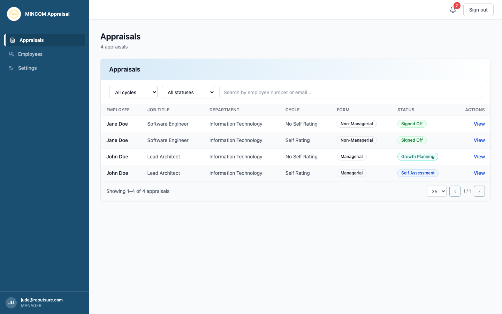

# Approving Sign-Off

> **Role:** Manager

## Overview

Once the growth plan is complete the appraisal moves to **Pending Signoff**. Both you and the employee record an electronic signature on the appraisal — accepting it as final, or rejecting it back to discussion.

## Steps

### Step 1: Open the appraisal

From **Appraisals**, click **View** on the row in **Pending Signoff** status.

### Step 2: Open the Sign-off tab

Click **Sign-off** at the top of the appraisal.

### Step 3: Decide

Two options are available for the manager signature:

- **Accept** — you agree the appraisal is final.
- **Reject** — you do not agree, and the appraisal returns to **Discussion** as a dispute.

### Step 4a: Accept

Click **Accept** in the manager signature block. Confirm in the dialog. Your signature is recorded with a timestamp.

### Step 4b: Reject

If you have second thoughts after the discussion:

1. Click **Reject**.
2. Type a short reason.
3. Confirm.

The appraisal returns to **Discussion** so you and the employee can resolve the issue. HR is notified.

> ⚠️ **Warning:** Once you Accept, the decision is permanent. You cannot reverse it without HR intervention.

## What Happens Next

- **If both you and the employee accept:** the appraisal moves to **Signed Off**. HR will then finalise it.
- **If the employee rejects:** the appraisal moves to **Disputed** and back to **Discussion**.
- **If you reject:** same as above — appraisal returns for discussion.

## Common Questions

**Q: The employee has not signed yet — can I still sign?**
A: Yes. Either party can sign first. The appraisal only moves to **Signed Off** when both parties have accepted.

**Q: I rejected by mistake.**
A: Contact HR. They can review the audit log and reverse the rejection if appropriate.

**Q: Do I need to print and sign anything?**
A: No. The electronic signature in the platform is the official record.
