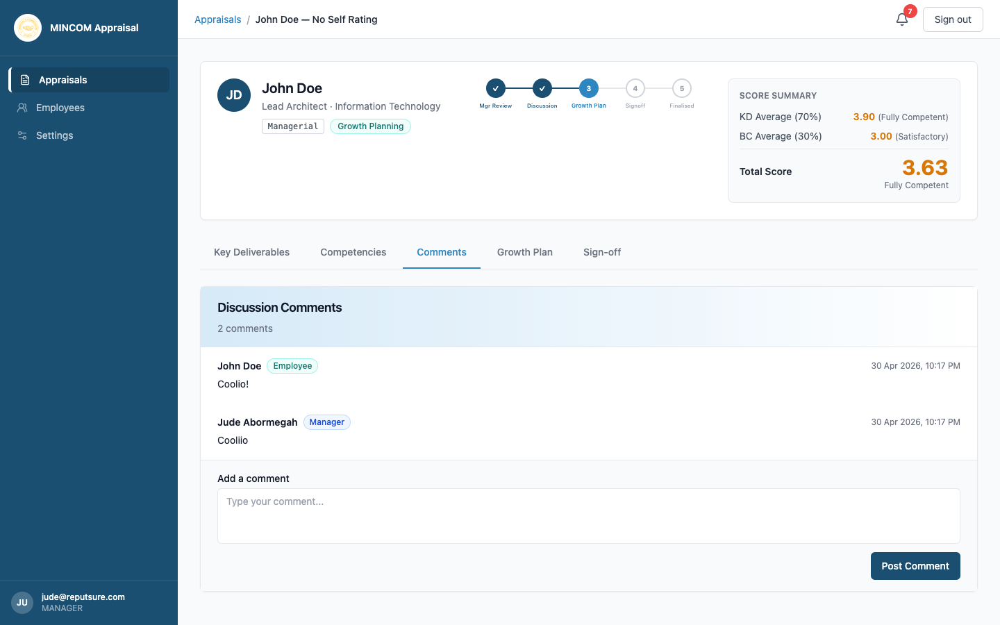

# Conducting the Discussion

> **Role:** Manager

## Overview

The **Discussion** stage is the face-to-face conversation between you and your direct report. The platform is open to both of you during this stage — you can both view ratings, see each other's comments, and add notes from the meeting.

## Steps

### Step 1: Schedule the meeting

The platform sends both parties a notification when the appraisal moves to **Discussion**. Schedule a meeting at a time that works for both of you. Allow 30 to 60 minutes for a thorough conversation.

### Step 2: Prepare

Before the meeting, open the appraisal and review:

- Your manager ratings and the employee's self-ratings, side by side.
- The **Comments** tab to see anything the employee has already noted.
- The score summary — how the **KD Average**, **BC Average**, and **Total Score** compare to expectations.

### Step 3: Hold the conversation

During the meeting, walk through:

- Each Key Deliverable, the rating you gave, and why.
- Each Competency, especially where your rating differs from the self-rating.
- The employee's self-assessment and any specific points they raised.
- Strengths to keep building on, and weaknesses to develop.

### Step 4: Capture notes in Comments

Either of you can add comments during or after the meeting. Use the **Comments** tab to record:

- Examples discussed.
- Agreed actions.
- Areas of disagreement.

Both parties must contribute at least one comment for the appraisal to move on.

### Step 5: Move to Growth Planning

When the discussion is complete and comments are recorded, click **Mark Discussion Complete**. The appraisal advances to the next stage.

## What Happens Next

- The status changes to **Growth Planning**.
- You become responsible for drafting the growth plan — see [Creating a growth plan](creating-growth-plan.md).
- The employee receives a notification and can view the plan once you save it.

## Common Questions

**Q: Can the employee move the discussion forward?**
A: No. Only the manager can transition out of Discussion.

**Q: We need more time to discuss. Can the discussion stage stay open?**
A: Yes — the stage stays open as long as you need. Add more comments as the conversation continues, and only move to Growth Planning once you are both ready.

**Q: What if we cannot agree?**
A: Try to find common ground first. If you cannot, the employee can dispute the appraisal at sign-off, and HR will mediate.
