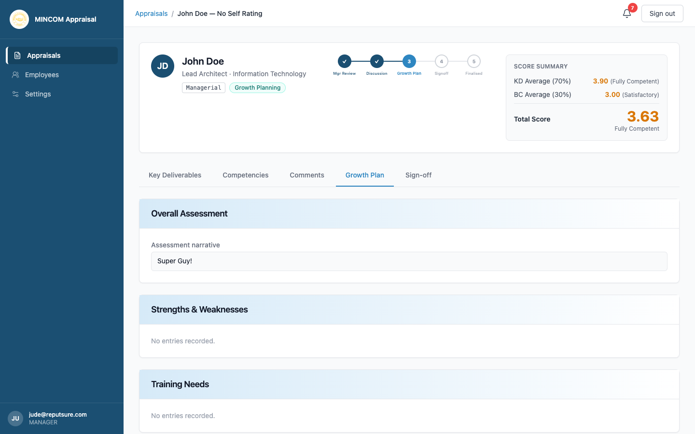

# Creating a Growth Plan

> **Role:** Manager

## Overview

The growth plan turns the appraisal conversation into a development roadmap for the next cycle. As the manager you are responsible for capturing strengths, weaknesses, training needs, and career direction. The platform aggregates this data into HR's training-needs and career-pipeline reports.

## Steps

### Step 1: Open the Growth Plan tab

From the appraisal in **Growth Planning** status, click the **Growth Plan** tab.

### Step 2: Write the overall assessment

Type a short narrative summary of the cycle into the **Overall Assessment** field. Cover:

- The most significant achievements.
- The biggest challenges.
- Your overall view of the employee's performance.

### Step 3: List Strengths and Weaknesses

For each strength and each weakness:

1. Click **Add strength** or **Add weakness**.
2. Type a short description.
3. Save.

You must record at least **one strength** and **one weakness** before the appraisal can move on.

### Step 4: Define Training Needs

Click **Add training need** for each course, certification, or experience the employee should pursue. Be specific — "ITIL Foundation by end of Q2" is more useful than "more training".

You must record at least **one training need**.

### Step 5: Capture Career Plans

Use the **Career Plans** section to record where this employee is heading next — promotion target, lateral move, or specialisation. Add the development needs that bridge the gap between today and that goal under **Career Plan Development Needs**.

### Step 6: Save and submit the growth plan

A **Saved** indicator appears each time the platform saves your changes. Once you are ready to send the appraisal to sign-off, click **Mark Growth Plan Complete** (or the equivalent button at the top of the page). The appraisal moves to **Pending Signoff**.

> 💡 **Tip:** The growth plan is shared with the employee and HR. Phrase weaknesses as development opportunities — "needs more practice presenting to senior leadership" is better than "weak presenter".

## What Happens Next

- The appraisal moves to **Pending Signoff**.
- Both you and the employee receive a notification asking you to sign off.
- The employee can now view the growth plan in their own appraisal page.

## Common Questions

**Q: Can the employee see the plan as I write it?**
A: The employee can see the plan as soon as you save changes. Many managers prefer to draft locally first and paste in a finished version.

**Q: Do I need to fill every section?**
A: At minimum you need one strength, one weakness, and one training need. Career plans are encouraged but not required — leave them empty if not applicable to this cycle.

## Troubleshooting

| Problem | Cause | Solution |
|---------|-------|----------|
| Cannot mark growth plan complete | Required sections empty | Check that Strengths, Weaknesses, and Training Needs each have at least one entry |
| Saved indicator not appearing | Network issue | Wait a few seconds and try again — your typing is buffered |
