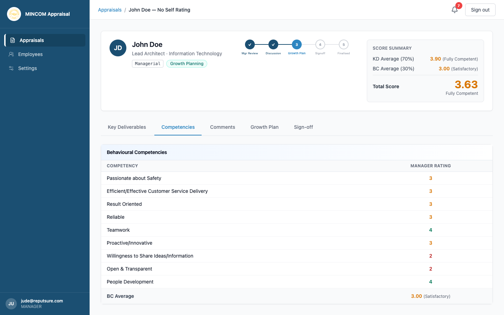

# Rating Behavioural Competencies

> **Role:** Manager

## Overview

Behavioural Competencies measure how the work was delivered — teamwork, customer service, reliability, and similar traits. They carry **30%** of the final score. The set of competencies depends on the appraisal form (Form A for Managerial, Form B for Non-Managerial).

## Steps

### Step 1: Open the Competencies tab

From an appraisal in **Manager Review**, click the **Competencies** tab.

### Step 2: Read the competency list

Form A (Managerial) covers competencies such as:

- Passionate about Safety
- Efficient/Effective Customer Service Delivery
- Proactive/Innovative
- Result Oriented
- Reliable
- Willingness to Share Ideas/Information
- Open & Transparent
- Teamwork
- People Development

Form B (Non-Managerial) covers a slightly different set including **Discipline and Honest** and **Willingness to be Challenged**.

Up to 17 competency slots exist on each form. HR can enable additional slots if your organisation defines extra competencies.

### Step 3: Pick your rating

For each competency, pick a value from 1 to 5 in the **Mgr Rating** column:

- **5** — Outstanding
- **4** — Very Good
- **3** — Satisfactory
- **2** — Not Satisfactory
- **1** — Unacceptable

If a competency does not apply to the role, leave it blank — only competencies you rate are included in the average.

### Step 4: Watch the score summary update

The **BC Average** and **Total Score** at the top of the appraisal update as you rate each competency.

## What Happens Next

- Once every applicable competency has a rating and the Key Deliverables tab is complete, you can submit the manager review.
- The appraisal moves to **Discussion** for the conversation with the employee.

## Common Questions

**Q: Why are the descriptors different from the Key Deliverables scale?**
A: The platform uses two scales — a "performance" scale for KDs (Below Standard → Outstanding) and a "behavioural" scale for competencies (Unacceptable → Outstanding). The numerical ratings are the same, but the descriptive labels match the language in the original MINCOM templates.

**Q: Do I have to rate all 17 slots?**
A: No. Only rate the competencies that are relevant to the role. Empty competencies do not count toward the average.
