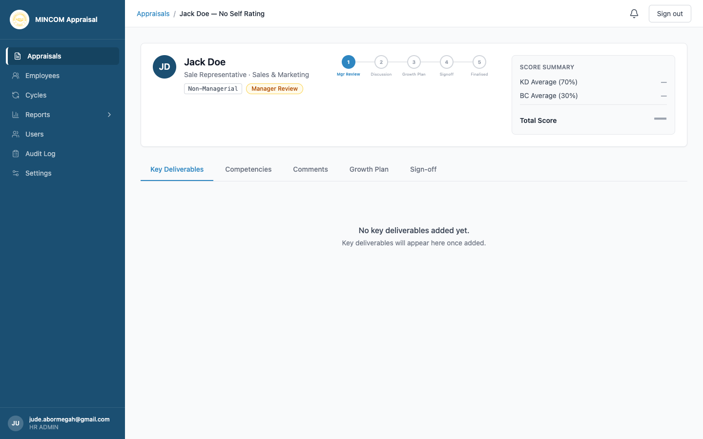

# Rating Key Deliverables

> **Role:** Manager

## Overview

Key Deliverables (KDs) are the performance objectives your direct report is measured on. They are grouped into four Balanced Scorecard (BSC) perspectives — Financial, Customer, Internal Business Processes, and Learning and Growth. Together they carry **70%** of the final score.

## Steps

### Step 1: Open the appraisal in Manager Review

From **Appraisals**, click **View** on the row showing **Manager Review** status.

### Step 2: Open the Key Deliverables tab

The tab is selected by default. Each perspective is shown as its own section with a heading and a table.

For each perspective the heading shows:

- **Weight** — the perspective's share of the total (must add up to 100% across all four).
- **Items** — how many KDs are in this section.

### Step 3: Add or edit KDs (if the cycle allows)

If a perspective is empty:

1. Click **+ Add key deliverable**.
2. Type a description and weight (a percentage).
3. Save.

When self-rating is enabled and the employee has already submitted, the KD descriptions are locked. You can only adjust the **Mgr Rating** column.

### Step 4: Set your Manager Rating

For each KD, pick a rating from 1 to 5 in the **Mgr Rating** column. The rating scale is:

- **5** — Outstanding
- **4** — Exceeds Expectations
- **3** — Fully Competent
- **2** — Generally Performing
- **1** — Below Standard

The **Weighted Score** column updates as you change the rating. The score summary at the top of the page recalculates the **KD Average** and the **Total Score** in real time.

> 💡 **Tip:** Aim for fairness across your team. The **Manager Effectiveness** report (HR) flags managers whose ratings are consistently far above or below the organisation-wide distribution.

### Step 5: Confirm weights total 100%

The footer of the Key Deliverables tab shows the running total of weights. The platform blocks submission if this is not exactly 100%.

## What Happens Next

- Once every KD has a Manager Rating and the **Competencies** tab is also complete, the **Submit Manager Review** button becomes active.
- Submitting moves the appraisal to **Discussion**, where both you and the employee can leave comments.

## Common Questions

**Q: Can I add a new perspective?**
A: No. The four BSC perspectives are fixed. You add KDs inside an existing perspective.

**Q: My report's weights total 99%.**
A: Adjust one of the weights to bring the total to exactly 100%. The system rejects submissions otherwise.

**Q: What happens if self-rating is disabled?**
A: You only see your **Mgr Rating** column. The Self Rating column is hidden, and the KD Average is calculated from your ratings only.
