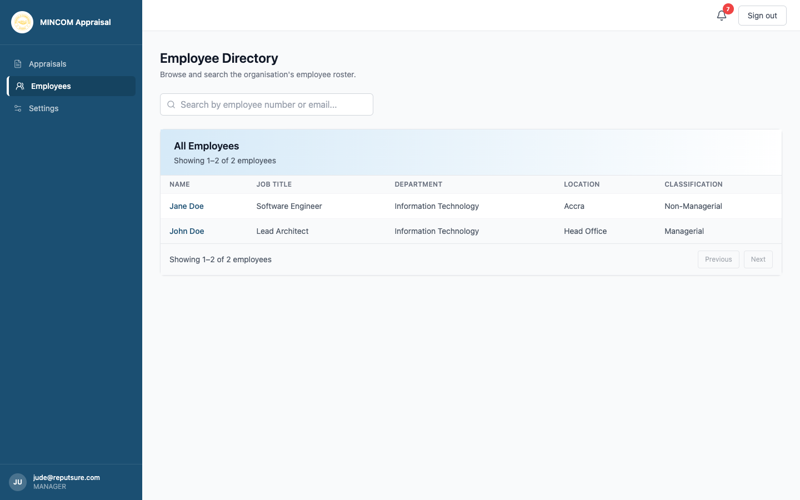
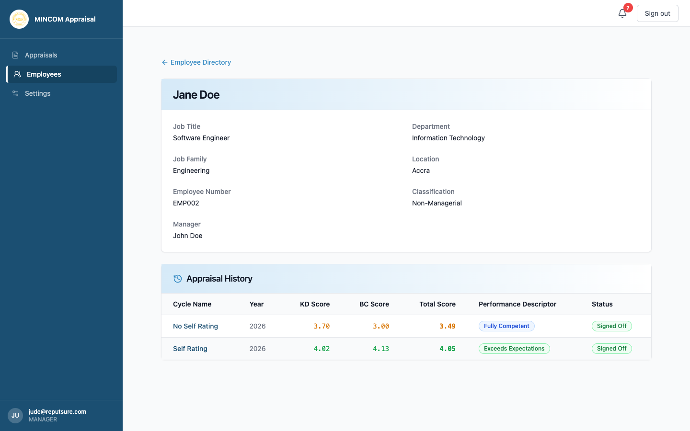

# Viewing Your Direct Reports

> **Role:** Manager

## Overview

The **Employees** page lists everyone who reports to you. From there you can open each person's profile, see their appraisal history, and jump into their current appraisal.

## Steps

### Step 1: Open the Employees page

Click **Employees** in the left sidebar.

### Step 2: Read the directory

Each row shows the employee's name, job title, department, location, and classification (Managerial or Non-Managerial). Use the **Search employees** box at the top to filter by name.

### Step 3: Open a profile

Click an employee's row. The profile shows:

- Personal details (job title, department, employee number, classification).
- The linked user account and login status.
- Direct reports under that employee, if they manage anyone.
- Their full appraisal history with cycle, scores, and current status.

### Step 4: Jump into an appraisal

From the **Appraisal History** section of the profile, click any cycle name to open that appraisal directly. You can also reach it from the **Appraisals** page in the sidebar.

## What Happens Next

- From a profile you have read-only access to past appraisals.
- For active appraisals, you see the same form your direct report sees, with manager-only controls (rating columns, growth plan editor, and sign-off button).

## Common Questions

**Q: I cannot see someone who reports to me.**
A: Their employee record may have a different manager, or their account is inactive. Ask HR to check the linkage.

**Q: Can I see employees who do not report to me?**
A: No — Managers only see their direct reports. Speak to HR if you need wider access.
