# Analytics and Dashboards

> **Role:** HR Admin

## Overview

The **Reports** menu provides twelve analytics pages covering every angle of the appraisal cycle — completion rates, score distribution, competency gaps, manager effectiveness, dispute logs, training needs, and more. Most pages can be filtered by cycle and exported.

## Steps

### Step 1: Open the Reports menu

Click **Reports** in the left sidebar. The menu expands to show every available page.

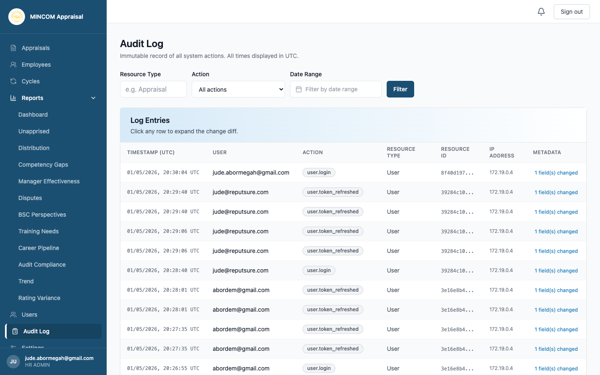

### Step 2: Pick a cycle

Every page applies to a specific cycle. The cycle picker is at the top of each page — pick **Active**, **Closed**, or any historical cycle.

### Step 3: Browse the available pages

Use the descriptions below to pick the right page:

#### Dashboard

A summary of the headline metrics — completion rate, signed off rate, score distribution, and dispute count.

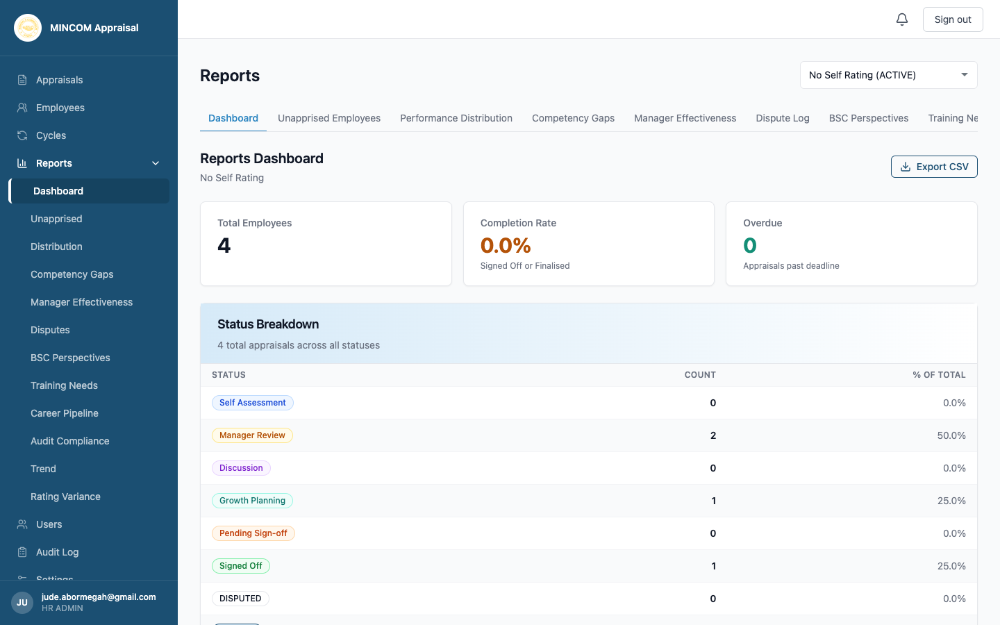

#### Unappraised Employees

Lists employees who have not completed their appraisals. Use this to chase up overdue submissions before the cycle closes.

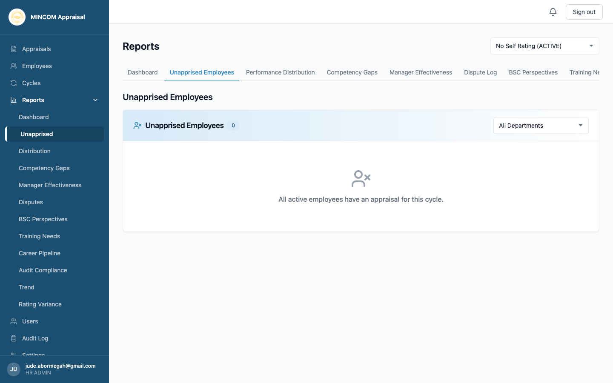

#### Performance Distribution

Shows how many employees fell into each performance descriptor — Below Standard through Outstanding. Useful to check for unhealthy patterns (everyone rated 5, or excessive bell-curving).

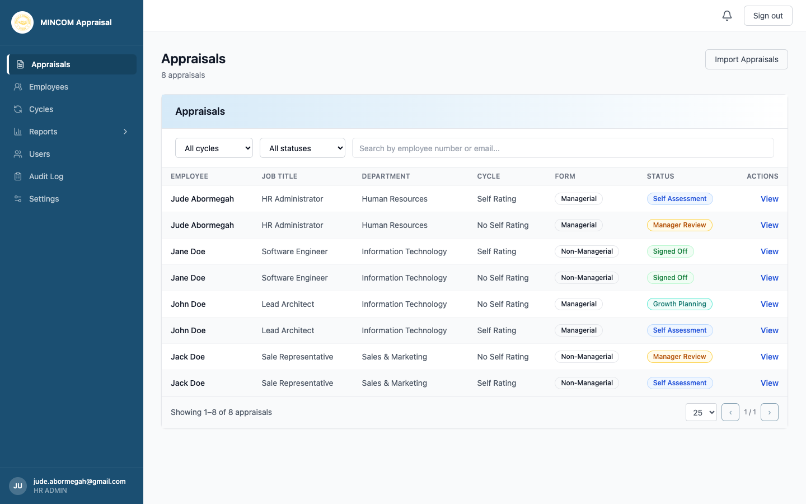

#### Competency Gaps

Highlights competencies where the organisation is weakest. Aggregates manager ratings across all appraisals and flags low scores. To add, edit, or deactivate the competencies that feed this report, see [Managing Competencies](managing-competencies.md).

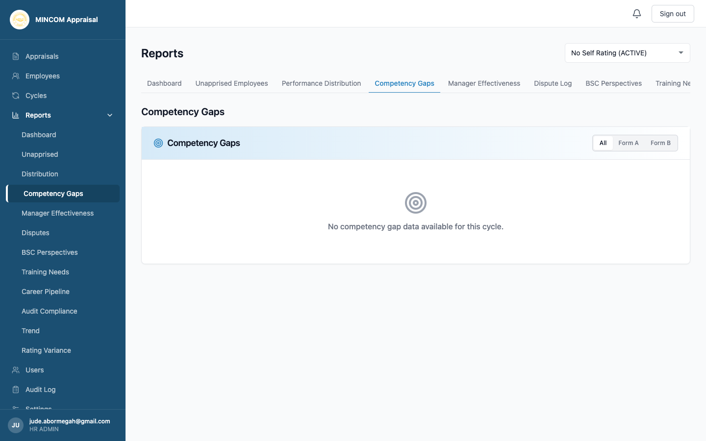

#### Manager Effectiveness

Compares each manager's average ratings against the organisation. Flags managers who are unusually generous or strict.

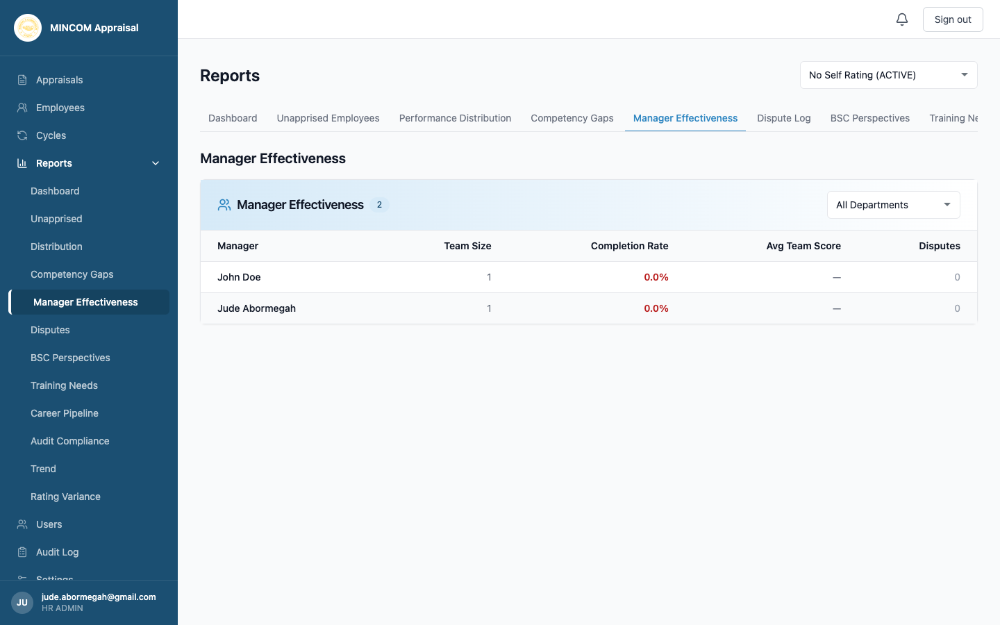

#### Dispute Log

Lists every appraisal currently in Disputed status, with the rejection reason and the parties involved. HR's primary worklist for mediating disagreements.

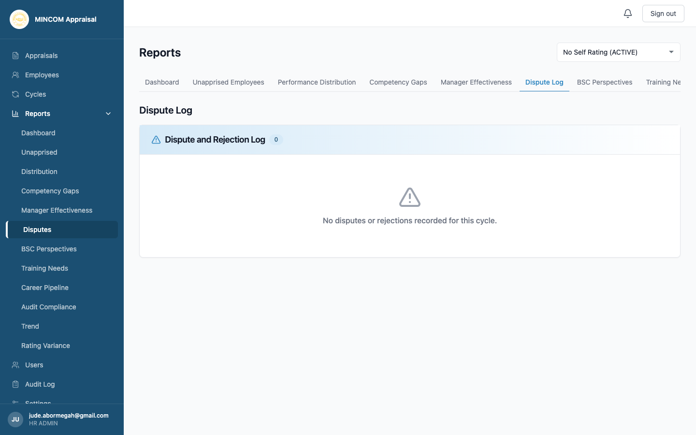

#### BSC Perspectives

Aggregates Key Deliverable scores by Balanced Scorecard perspective (Financial, Customer, Internal Business Processes, Learning and Growth) across the whole organisation.

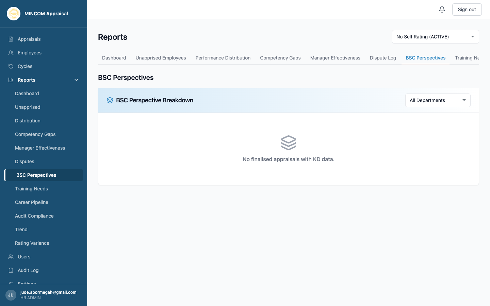

#### Training Needs

Aggregates the Training Needs entries from every growth plan into one organisation-wide list — your input for the next training plan.

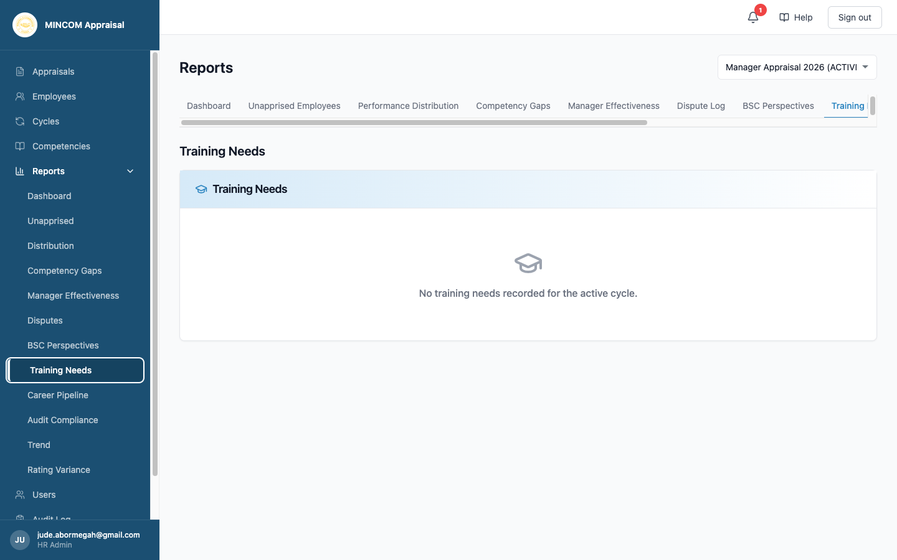

#### Career Pipeline

Aggregates Career Plans entries from every growth plan. Tells you where employees are aiming and what they need to get there.

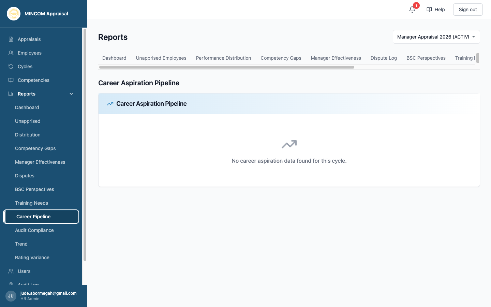

#### Audit Compliance

Compliance-focused summary showing how many appraisals were properly signed off, finalised, or skipped — useful for ISO 27001 and SOC 2 evidence.

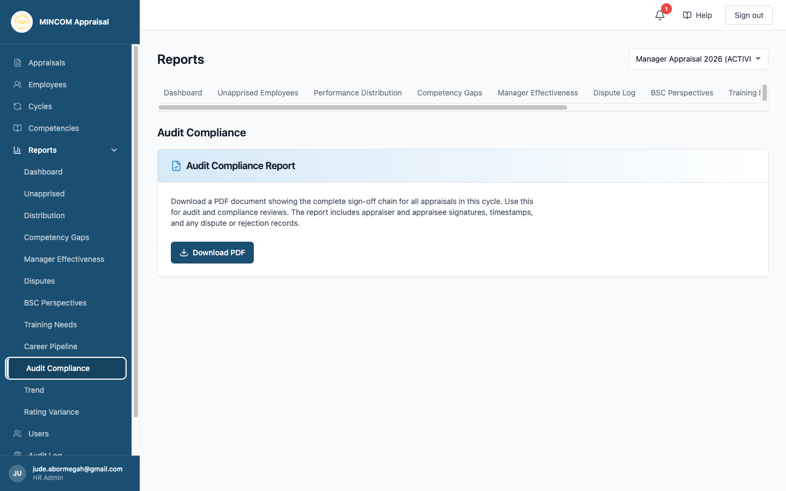

#### Trend

Compares scores across cycles to track how the organisation is performing over time.

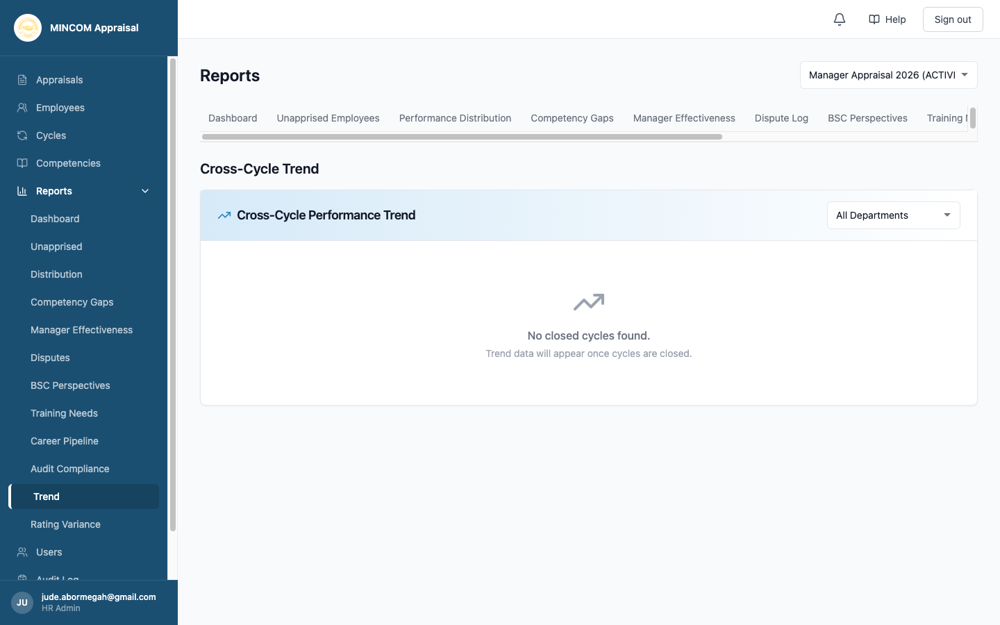

#### Rating Variance

Compares self-ratings to manager ratings. Large gaps may indicate calibration issues, communication problems, or training opportunities.

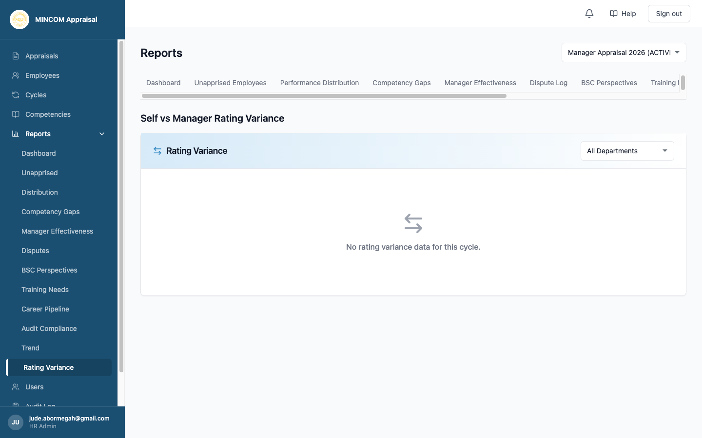

### Step 4: Export

Most pages include an Export button at the top — pick CSV, Excel, or PDF depending on what is offered. The export reflects the current filter settings.

## What Happens Next

- Pages always reflect the latest data — there is no nightly batch.
- Exports are generated on demand and downloaded in your browser.

## Common Questions

**Q: A page is empty.**
A: Check the cycle picker. Some pages require a fully signed-off cycle to show data — for example Trend needs at least two cycles.

**Q: Can I share a page output with someone outside HR?**
A: Yes — export it as PDF and email the file. Do not give non-HR users access to the platform Reports section.

**Q: How often is the data refreshed?**
A: Live. Every page runs against the current database when you load it.
