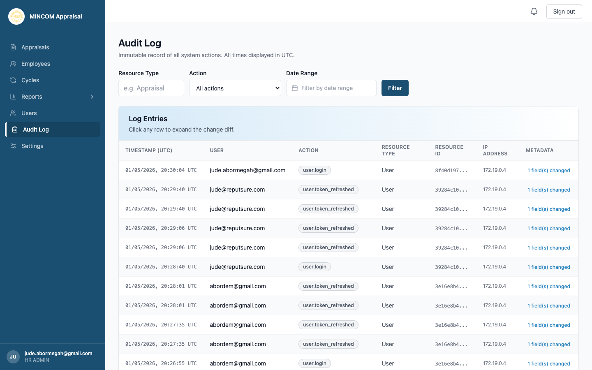

# Reviewing the Audit Log

> **Role:** HR Admin

## Overview

The **Audit Log** is the platform's immutable record of every action — sign-ins, rating changes, growth-plan updates, role changes, and more. Every entry is timestamped in UTC and linked to the user who performed the action.

> 💡 **Tip:** The audit log supports compliance with ISO 27001 / SOC 2 record-keeping requirements. Treat it as the source of truth when investigating disputes or anomalies.

## Steps

### Step 1: Open the Audit Log

Click **Audit Log** in the left sidebar.

### Step 2: Filter the entries

Three filters are at the top of the page:

- **Resource Type** — type a resource (for example `Appraisal`, `User`, `GrowthPlan`).
- **Action** — pick from a long dropdown of action codes such as `appraisal.transition`, `user.login_failed`, `growth_plan.updated`.
- **Date Range** — pick from-and-to dates.

Click **Filter** to apply.

### Step 3: Read the table

Each row shows:

- **Timestamp (UTC)** — exact time the action occurred.
- **User** — the email of the actor (or `system` for automated actions).
- **Action** — the action code.
- **Resource Type** and **Resource ID** — what was affected.
- **IP Address** — where the request came from.
- **Metadata** — extra context shown in a short summary.

### Step 4: Expand a row to see the diff

Click any row to expand it. Where the action changed a record, the audit log shows the **before** and **after** values for each field that changed.

### Step 5: Investigate a specific user or appraisal

Combine filters to narrow down. For example:

- "All actions by `jane@example.com` in the past 7 days" — set User and Date Range.
- "All transitions on appraisal `abc-123`" — set Resource Type to `Appraisal` and Resource ID to the UUID.
- "Failed sign-ins this week" — set Action to `user.login_failed`.

## What Happens Next

- The audit log is read-only. Entries cannot be edited or deleted.
- All filtering happens in your browser session and does not affect what other users see.
- For evidence in formal investigations, take screenshots of the relevant rows or export the report through your organisation's normal procedures.

## Common Questions

**Q: How long are entries kept?**
A: Audit log entries are retained for the full lifetime of the platform record-keeping policy. Ask your IT team for the exact retention setting.

**Q: Why are some entries from `system`?**
A: Automated jobs (cycle activation, scheduled notifications) run as the system user.

**Q: Can I see what was changed in detail?**
A: Yes — click the row to expand the change diff. Field-level before/after values are shown when applicable.
