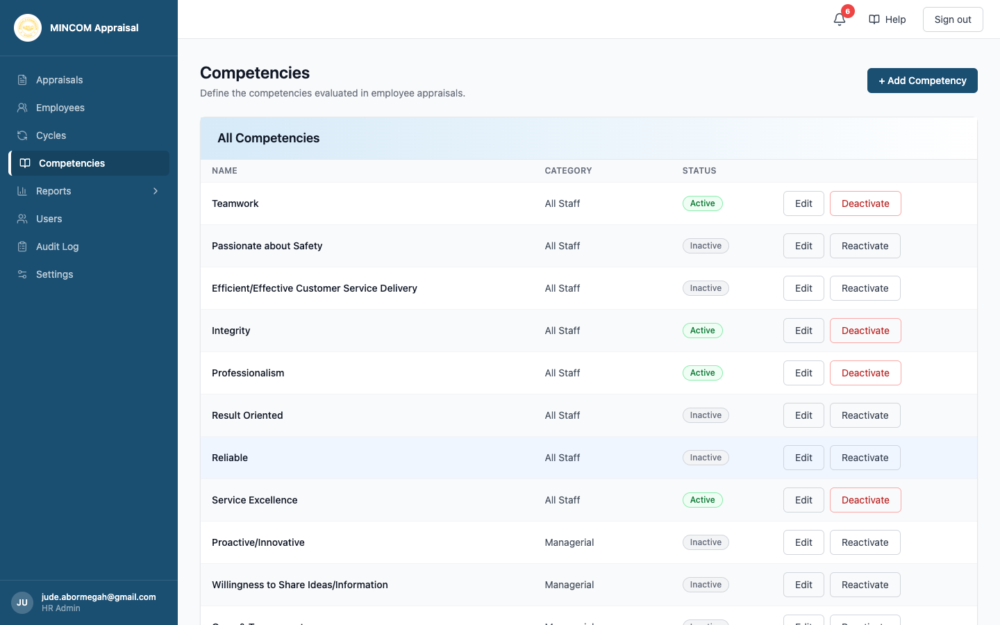
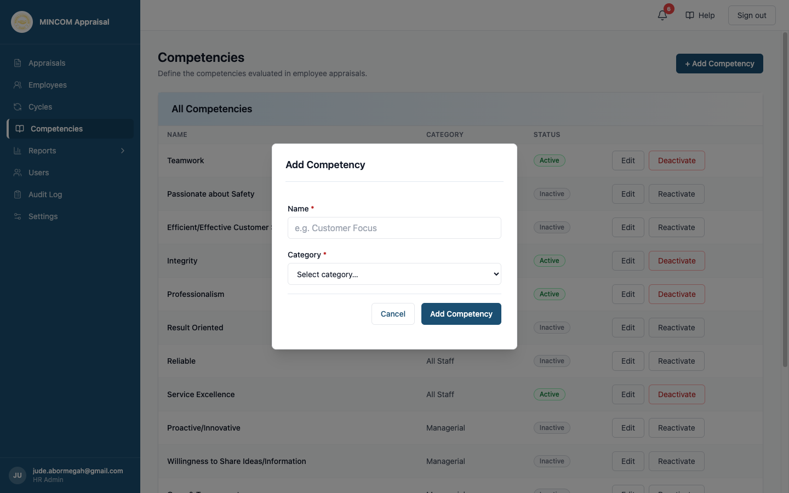
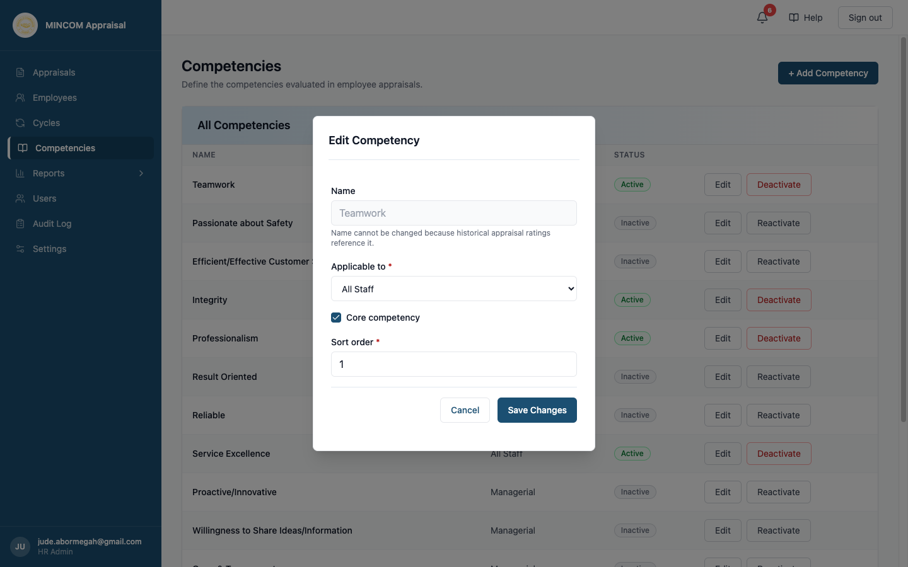

# Managing Competencies

> **Role:** HR Admin

## Overview

Behavioural competencies measure the **how** of performance — the attitudes and behaviours an employee demonstrates day-to-day. Unlike Key Deliverables (which measure what was delivered against targets), competencies are rated on a 1–5 scale by the manager on every appraisal. The platform takes the unweighted average of those manager ratings to produce the **BC Average**, which contributes 30% of the overall Total Score. See [Scoring Methodology](../05-reference/scoring-methodology.md) for the full formula.

The **Competencies** page lets you add new competencies, edit their settings, and deactivate ones that are no longer in use. It is accessible only to HR Admins via the **Competencies** entry in the left sidebar.

## Steps

### Step 1: Open the Competencies page

Click **Competencies** in the left sidebar. The page lists every competency that exists in the system — both active and inactive.

The table has four columns:

- **Name** — the competency label that appears on appraisal forms and PDF reports.
- **Category** — whether the competency applies to All Staff, Managerial appraisals only, or Non-Managerial appraisals only.
- **Status** — Active (green) or Inactive (grey).
- **Actions** — Edit and Deactivate (or Reactivate) buttons for each row.

### Step 2: Review the default catalogue

The four competencies that are **Active** by default are:

| Name | Category | Notes |
|------|----------|-------|
| Teamwork | All Staff | Core competency |
| Integrity | All Staff | Core competency |
| Professionalism | All Staff | Core competency |
| Service Excellence | All Staff | Core competency |

These four appear on every appraisal generated by a new cycle. Historical appraisals from before 2026 may reference a larger set of competencies — those older entries remain in the list as Inactive and are preserved for the audit trail. They do not appear on any new appraisal forms.

### Step 3: Add a new competency

1. Click **+ Add Competency** at the top right.
2. In the dialog, fill in:
   - **Name** — the label that will appear on appraisal forms and reports.
   - **Category** — choose one:
     - **All Staff** — appears on every appraisal form (both managerial and non-managerial).
     - **Managerial** — appears on Form A appraisals only (employees who manage others).
     - **Non-Managerial** — appears on Form B appraisals only (individual contributors).
3. Click **Add Competency**.

> 💡 **Tip:** The new competency becomes available immediately, but employees will only see it on appraisals generated after you activate the next cycle. Competencies are baked into each appraisal at cycle activation — they are not added retrospectively to in-progress appraisals.

### Step 4: Edit a competency

1. Find the competency row in the table.
2. Click **Edit** on that row.
3. The Edit Competency dialog opens, pre-filled with the current values.

The editable fields are:

- **Applicable to** — change which appraisal form types this competency appears on (All Staff, Managerial, or Non-Managerial).
- **Core competency** — tick to mark this as a foundational behaviour. This is informational: the scoring engine averages all rated competencies together regardless of whether they are marked Core.
- **Sort order** — an integer (0 or higher) controlling the display order on the appraisal form's Competencies tab and on the printed PDF. Lower numbers appear first.

> ⚠️ **Warning:** The **Name** field is locked and cannot be changed. Historical appraisal ratings are stored against the competency name; renaming it would break those records. If you need a differently named competency, deactivate the old one and add a new one with the correct name.

4. Make your changes and click **Save Changes**. If you click Save without making any changes, the dialog closes silently with no update sent to the server.

### Step 5: Deactivate or reactivate a competency

**To deactivate:** Click **Deactivate** on an Active competency row. The Status badge changes to Inactive and the button changes to Reactivate. The competency is immediately hidden from any cycle activated afterwards, but all existing ratings on historical appraisals are preserved intact.

**To reactivate:** Click **Reactivate** on an Inactive competency row. The competency returns to Active status and will appear on appraisals generated by the next cycle you activate.

> ⚠️ **Warning:** Deactivating a competency mid-cycle does not remove it from in-progress appraisals in that cycle. Managers will still see and be able to rate it for appraisals that were generated before the deactivation. The change only affects future cycle activations.

## What Happens Next

- **Add or Reactivate:** The competency is included in every appraisal form created when you next activate a cycle. It appears in the order determined by its Sort order value.
- **Edit:** Changes to Applicable to, Core competency, and Sort order take effect on the next cycle activation. They do not affect appraisals already in progress.
- **Deactivate:** The competency no longer appears on any new appraisal forms. Existing ratings in historical and in-progress appraisals are unaffected.
- **Audit trail:** Every Add, Edit, Deactivate, and Reactivate action writes an entry to the **Audit Log**, capturing the acting user, timestamp, and before-and-after values of every changed field. See [Reviewing the Audit Log](audit-log.md).

To understand which competency gaps have emerged across the organisation, see the **Competency Gaps** report under [Analytics and Dashboards](analytics-and-dashboards.md).

## Common Questions

**Q: Can I rename a competency?**
A: No. The Name field is locked once a competency has been saved. Historical appraisal ratings reference the name directly, so changing it would corrupt the audit trail. Deactivate the old competency and add a new one with the correct name instead.

**Q: What happens if I deactivate a competency while a cycle is still running?**
A: Nothing changes for in-progress appraisals. Managers already assigned that competency will still see and rate it until those appraisals are signed off. The deactivation only prevents the competency from appearing on appraisals generated in future cycles.

**Q: Why do I see more than four competencies in the list?**
A: The platform preserves all competencies that have ever been used, including those from older appraisal templates. Inactive competencies are kept for the audit trail so that historical appraisal scores remain meaningful. Only the four Active competencies appear on new appraisal forms.

**Q: Can I reorder competencies?**
A: Yes. Edit any competency and update its **Sort order** value. Lower numbers appear first on the appraisal form and PDF. To move a competency to the top, give it a Sort order of 0 or 1 and adjust the others accordingly.
