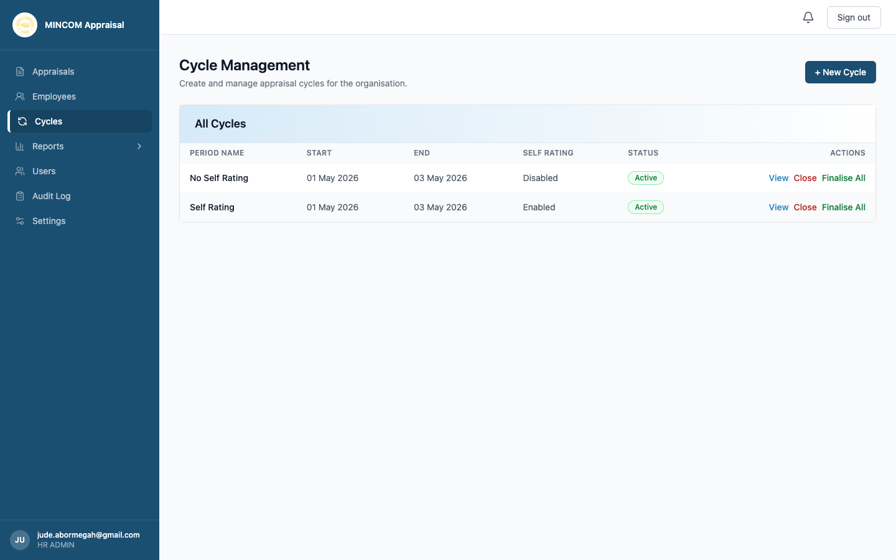
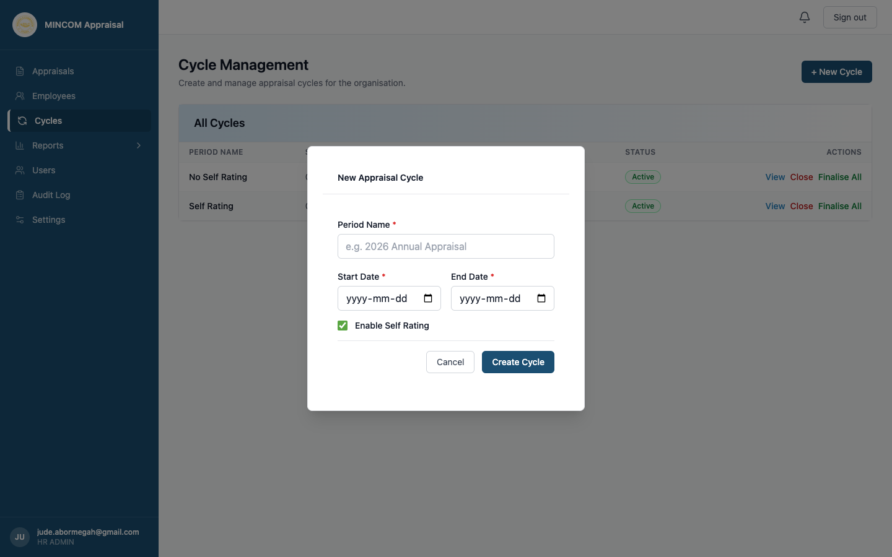
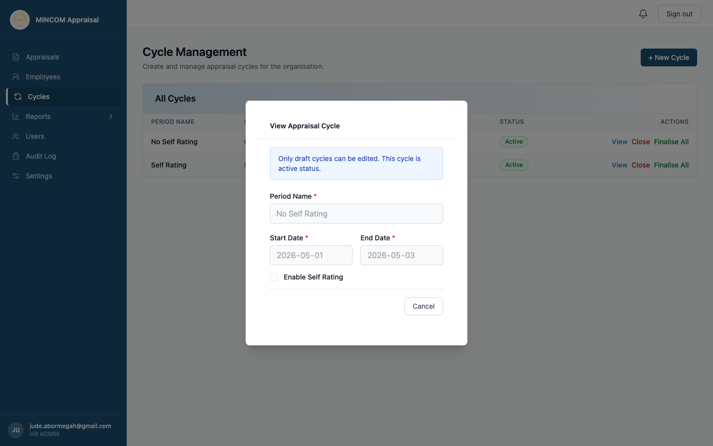

# Managing Appraisal Cycles

> **Role:** HR Admin

## Overview

A **cycle** is one round of appraisals — typically annual or semi-annual. As HR Admin you create cycles, choose whether self-rating is enabled, activate them so employees see their forms, and eventually close and finalise them.

## Steps

### Step 1: Open the Cycles page

Click **Cycles** in the sidebar.

The table shows each cycle's period name, start and end dates, whether self-rating is enabled, and current status. Active cycles have **View**, **Close**, and **Finalise All** buttons.

### Step 2: Create a new cycle

1. Click **+ New Cycle**.
2. In the dialog, fill in:
   - **Period Name** — for example "2026 Annual" or "H1 2026".
   - **Start Date** — when the cycle begins.
   - **End Date** — when employees should have completed their work.
   - **Enable Self Rating** — tick to require employees to self-assess before manager review; untick to skip self-assessment.
3. Click **Create Cycle**.

The cycle is created in **Draft** status. No employees see appraisals yet.

### Step 3: Activate the cycle

When you are ready, click the **Activate** button on the cycle row. The platform creates one appraisal per active employee and emails everyone that their cycle has started.

### Step 4: Monitor progress

While the cycle is **Active**, the **Reports** section shows you progress in real time — see the **Unappraised Employees** report and the **Reports Dashboard**.

### Step 5: Close the cycle

When the deadline arrives, click **Close** on the cycle row.

> ⚠️ **Warning:** Closing a cycle moves any in-progress appraisals (not yet at Signed Off or Finalised) to **Incomplete** status. They keep their data but stop counting toward analytics.

### Step 6: View the cycle settings (read-only after activation)

Click **View** to inspect a cycle's configuration. Once a cycle is **Active**, all the fields are locked. Only **Draft** cycles can still be edited.

### Step 7: Finalise All

Click **Finalise All** to move every appraisal in **Signed Off** status to **Finalised**. Finalised appraisals are read-only and form the official record.

## What Happens Next

- Activating a cycle generates appraisals and notifies all employees.
- Closing a cycle stops further submissions for in-progress appraisals and tags them **Incomplete**.
- Finalising marks signed-off appraisals as the closed record. No further edits are possible.

## Common Questions

**Q: Can I run two cycles at the same time?**
A: Yes. Multiple cycles can be Active in parallel — for example a cycle with self-rating enabled and one without.

**Q: How do I edit a cycle after activation?**
A: You cannot. Plan carefully before activating. If you need to change anything, close the cycle and start a new one.

**Q: What does "No Self Rating" mean as a cycle name?**
A: That is just an example name in the screenshots — the platform uses whatever name you choose when creating the cycle. It is the **Self Rating** column in the cycles table that tells you whether employees self-assess.
