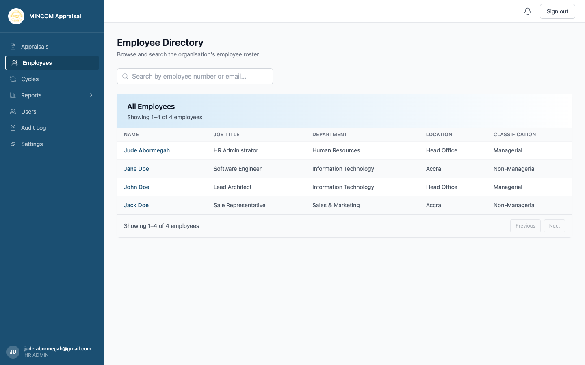
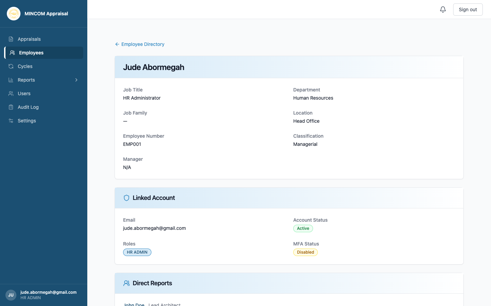

# Managing Employees

> **Role:** HR Admin

## Overview

The **Employees** page lists every active employee in the organisation. Each employee profile shows job and personal details, the linked user account, direct reports, and full appraisal history.

> 💡 **Tip:** Employee records are usually created automatically when you add a user (see [Managing users and roles](managing-users.md)). Use this page to inspect existing records and check appraisal history.

## Steps

### Step 1: Open the Employees page

Click **Employees** in the left sidebar.

The directory shows each employee's name, job title, department, location, and classification (Managerial or Non-Managerial). Use the **Search employees** box at the top to filter by name.

### Step 2: Open a profile

Click any employee row. The profile is divided into sections:

- **Personal details** — job title, department, employee number, classification, and assigned manager.
- **Linked Account** — the email used to sign in, account status, roles, and MFA status.
- **Direct Reports** — anyone who reports to this employee.
- **Appraisal History** — every cycle this employee has appeared in, with KD score, BC score, total score, performance descriptor, and current status.

### Step 3: Open an appraisal from the profile

Click any cycle name in the **Appraisal History** table to jump directly to that appraisal. As HR Admin you have read access at every stage.

### Step 4: Update employee details

To edit job title, department, classification, manager assignment, or other employee fields, open the user record under **Users**. Editing the user there updates the employee profile.

## What Happens Next

- Changes you make to employee profiles are picked up by the next cycle creation.
- Appraisal scores in the history table reflect the latest computed values from the scoring engine.

## Common Questions

**Q: An employee left the organisation — what do I do?**
A: Deactivate their user account from the **Users** page. Their employee record is preserved for historical reporting; their appraisals stay on file.

**Q: Why is the Manager field showing N/A?**
A: The employee has not been linked to a manager. Without a manager, no one can rate them. Edit the user record on the **Users** page and pick a manager.

**Q: Can I export the employee directory?**
A: Yes — export reports through **Reports → Career Pipeline** or **Reports → Distribution** depending on the data you need. The audit log can also be filtered to employee-level events.
