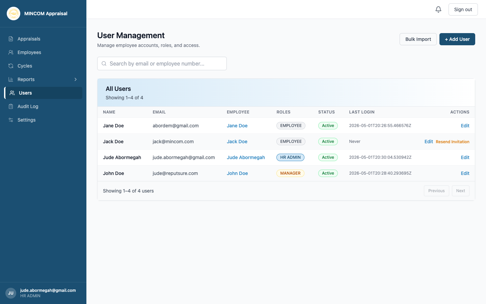
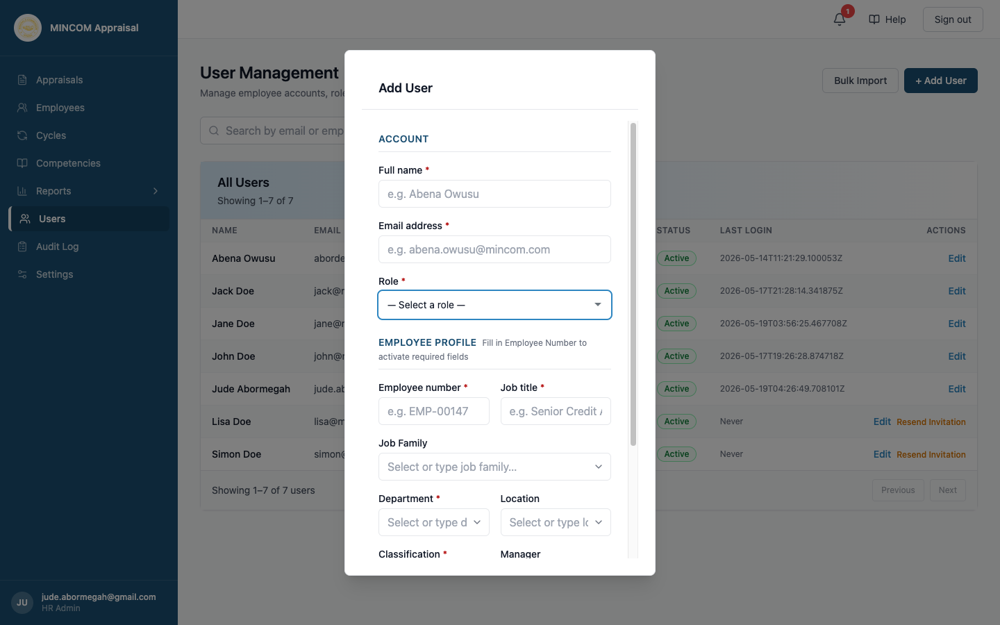

# Managing Users and Roles

> **Role:** HR Admin

## Overview

The **Users** page is where you add staff to the platform, assign roles, and manage their access. Adding a user creates both an account and the matching employee profile.

## Steps

### Step 1: Open the Users page

Click **Users** in the left sidebar.

### Step 2: Add a single user

1. Click **+ Add User**.
2. Fill in the **Account** section: full name, email, and tick at least one role.
3. Fill in the **Employee Profile** section: employee number, job title, department, location, classification, and manager.
4. Click **Create User**.

The platform sends an invitation email to the user with a link to set their password.

### Step 3: Assign roles

The available roles are:

- **Appraisee** — every staff member (except Executives) receives this role automatically. Executives are not appraised through this platform; they participate only as escalation targets.
- **Appraisor** — assign to anyone with at least one direct report.
- **HR Director** — read-only HR access for delegated staff.
- **HR Admin** — full administrative access.
- **Executive** — read-only access to dashboards and reports.

A user can have multiple roles — the sidebar combines the menus accordingly.

### Step 4: Edit an existing user

Click **Edit** on any row. You can update the account details, change roles, and deactivate the account. Changes are recorded in the audit log.

### Step 5: Resend an invitation

If a new user has not yet logged in, the table shows a **Resend Invitation** button. Click it to send a fresh invite email.

### Step 6: Bulk import users

Click **Bulk Import** to upload a spreadsheet of new users. Download the template from the dialog, fill it in, and upload. The platform validates each row and reports any errors before creating accounts.

## What Happens Next

- New users receive an invitation email immediately.
- Setting their password completes account creation; they can sign in straight after.
- Every user creation, role change, and deactivation appears in the **Audit Log**.

## Common Questions

**Q: An employee changed roles internally — do I create a new account?**
A: No. Edit the existing user record. Update the job title, department, and manager. Their appraisal history stays attached.

**Q: An employee left the organisation.**
A: Deactivate their account on the Edit User dialog. They can no longer sign in, but historical appraisals stay on file.

**Q: How do I reset someone's MFA?**
A: Edit the user record. The MFA status is shown in the linked employee profile. From the user dialog you can disable MFA — the user must then re-enrol on next sign-in.

## Troubleshooting

| Problem | Cause | Solution |
|---------|-------|----------|
| Invitation email not received | Spam filter or wrong email | Resend from the Users table; double-check the address |
| Cannot pick a Department | Department not yet defined | Departments are auto-created the first time they are typed; type a new one to add it |
| User cannot sign in | Account inactive or password not set | Check status on the Users page and resend invitation if needed |
