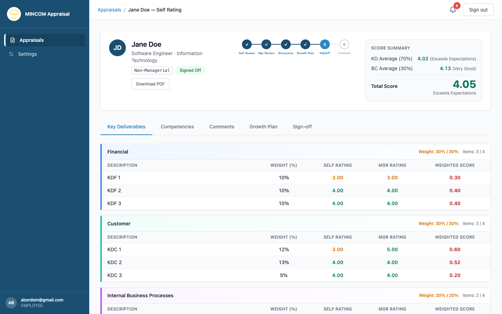

# Performance Descriptors

> **Role:** Everyone
> **Audience:** Employees, Managers, HR Admins

## Overview

Every score the platform produces is given a **descriptor** — a short label that translates the number into plain language. The platform uses two scales because the original MINCOM templates do: a "performance" scale for Key Deliverables and a "behavioural" scale for Competencies.

## The default descriptor table

The default labels (which match the client templates) are:

| Score range | Key Deliverable label | Competency label |
|-------------|----------------------|------------------|
| 0.0 – 1.99 | Below Standard | Unacceptable |
| 2.0 – 2.99 | Generally Performing | Not Satisfactory |
| 3.0 – 3.99 | Fully Competent | Satisfactory |
| 4.0 – 4.99 | Exceeds Expectations | Very Good |
| 5.0 | Outstanding | Outstanding |

The Total Score uses the **Key Deliverable** label scale, since it is the headline performance figure.

## Where descriptors appear

You see descriptors:

- In the **Score Summary** at the top of every appraisal — alongside KD Average, BC Average, and Total Score.
- On the appraisal PDF download.
- In every analytics page — Distribution, Trend, Manager Effectiveness — to label tiles and chart segments.

## Configurable per cycle

HR Admin can adjust the descriptor labels and ranges when creating a new cycle. The original ranges are kept as defaults, but organisations sometimes use slightly different language ("Meets Expectations" instead of "Fully Competent", for example).

> 💡 **Tip:** Once a cycle is **Active**, its descriptor configuration is frozen. This protects historical scores from changing meaning if the descriptor table is later edited.

## Common Questions

**Q: Why are KDs and Competencies labelled differently?**
A: The MINCOM templates use stricter language for behavioural competencies — the lowest band is "Unacceptable" rather than "Below Standard". The platform preserves that nuance.

**Q: My total score sits exactly on a band boundary (for example, 4.00). Which label applies?**
A: The lower bound of each band is inclusive. So 4.00 maps to **Exceeds Expectations** (4.0–4.99), not to **Fully Competent**.

**Q: Can the 70:30 weighting between KDs and BCs change?**
A: No. The 70:30 ratio is fixed by the original MINCOM template and cannot be adjusted in the platform.
